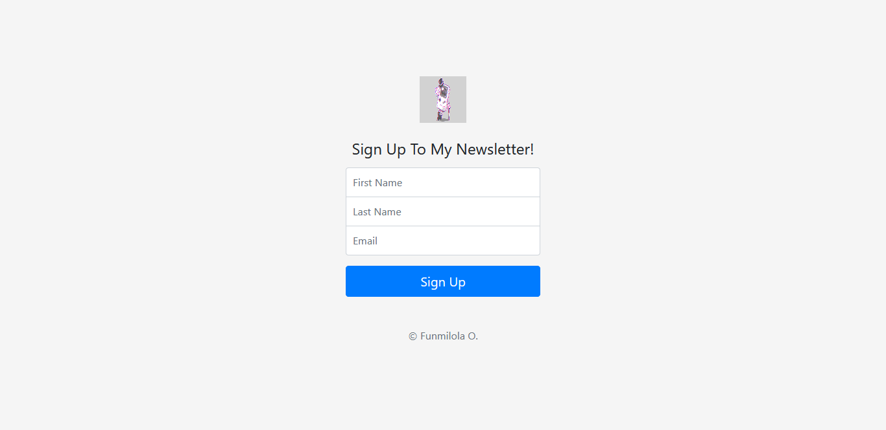

# Newsletter SignUp  

> A newsletter signup app built using node, express and mailchimp's api.

## Table of contents  

- [General info](#general-info)
- [Screenshots](#screenshots)
- [Technologies](#technologies)
- [Setup](#setup)
- [Features](#features)
- [Status](#status)
- [Inspiration](#inspiration)
- [Contact](#contact)

## General info  

A newsletter signup app built using node, express and mailchimp's api. The user fills in their full name and email address then hit submit to get added to the mailing list.

## Screenshots  

## Technologies  

- Axios - 0.20.0
- Body Parser - 1.19.0
- Express - 4.17.1

## Setup  

Visis [newsletter signup](https://newsletter-siignup.herokuapp.com/) in your browser.

## Features  

- Allows the user to subscribe to the mailing list
- Stores the user's full name and email on the subscribers list
- Subscribers will receive newsletters.

## Status  

Project is: _finished_

## Inspiration  

This project was inspired by a challenge from a udemy course.

## Contact  

Created by [@funmilolajire](mailto:funmilolajire@gmail.com) - feel free to contact me!  

